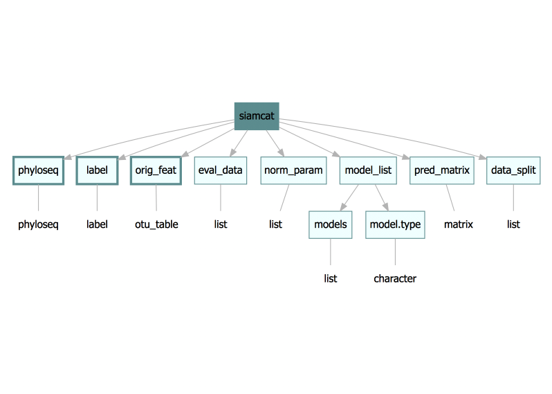
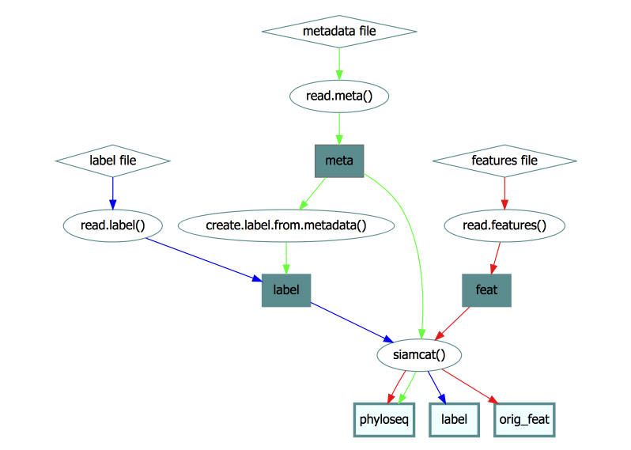
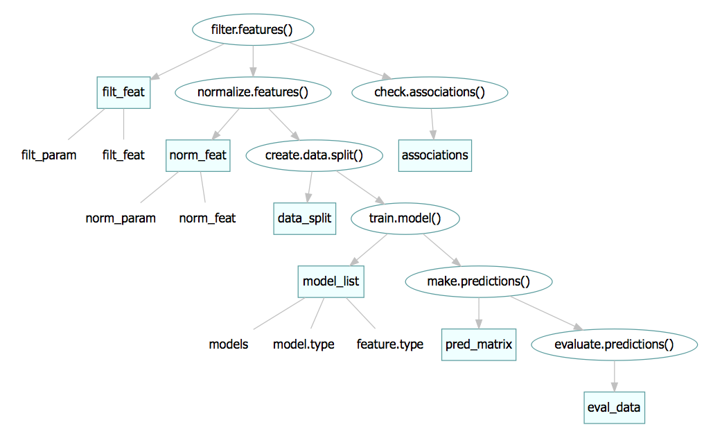

# Introduction

This vignette illustrates how to read and input your own data to the
`SIAMCAT` package. We will cover reading in text files from the disk, formatting
them and using them to create an object of `siamcat-class`.

The `siamcat-class` is the centerpiece of the package. All of the input data 
and result are stored inside of it. The structure of the object is described
below in the [siamcat-class object](#siamcat-class-object) section.


# Loading your data into R

## SIAMCAT format files

Generally, there are three input files in SIAMCAT format:

### Features file

The features file is a `.tsv` file that is organized as follows:

features (in rows) x samples (in columns).

The first row should contain the sample names and the first column the feature 
labels (e.g. taxonomic identifiers). The remaining entries are expected to be 
real values `>= 0` that quantify the **relative abundance** of each feature in 
each sample:

| | Sample_1 | Sample_2  | Sample_3 | Sample_4  | Sample_5 |
| --- | ---:| ---:| ---:| ---:| ---:|
| **Feature_1** | 0.59 | 0.71 | 0.78 | 0.61 | 0.66 |
| **Feature_2** | 0.00 | 0.02 | 0.00 | 0.00 | 0.00 |
| **Feature_3** | 0.02 | 0.00 | 0.00 | 0.00 | 0.20 |
| **Feature_4** | 0.34 | 0.00 | 0.13 | 0.07 | 0.00 |
| **Feature_5** | 0.06 | 0.16 | 0.00 | 0.00 | 0.00 |

An example of such a file is attached to the `SIAMCAT` package, containing
data from a publication investigating the microbiome in colorectal cancer (CRC)
patients and controls (the study can be found here:
[Zeller et al](http://europepmc.org/abstract/MED/25432777)). The metagenomics
data were processed with the [MOCAT](http://mocat.embl.de/) pipeline, returning
taxonomic profiles on the species levels (`specI`):

```{r message=FALSE}
library(SIAMCAT)
fn.in.feat  <- system.file(
    "extdata",
    "feat_crc_zeller_msb_mocat_specI.tsv",
    package = "SIAMCAT"
)
```

We can access the file with the dedicated `SIAMCAT` function `read.features`:

```{r message=FALSE}
feat  <- read.features(fn.in.feat)
# look at some features
feat[110:114, 1:2]
```

### Metadata file

The metadata file is also a `.tsv` file, organized as follows:

samples (in rows) x metadata (in columns):

The first row should contain metadata variables names and the first column
should contain sample names.

| | Age | Gender | BMI |
| --- | ---:| ---:| ---:|
| **Sample_1** | 52 | 1 | 20|
| **Sample_2** | 37 | 1 | 18 |
| **Sample_3** | 66 | 2 | 24 |
| **Sample_4** | 54 | 2 | 26 |
| **Sample_5** | 65 | 2 | 30 |

Again, an example of such a file is attached to the `SIAMCAT` package, taken
from the same study:

```{r message=FALSE}
fn.in.meta  <- system.file(
    "extdata",
    "num_metadata_crc_zeller_msb_mocat_specI.tsv",
    package = "SIAMCAT"
)
```

We can access the file with the `SIAMCAT` function `read.meta` and look
at the result:

```{r warning=FALSE}
meta  <- read.meta(fn.in.meta)
head(meta)
```


```{r echo=FALSE}
## need to be run to exclude adenoma patients
meta <- meta[meta$diagnosis != 5,]
```
### Label file

Finally, the label file is another `.tsv` file containing samples and labels.
The label file is optional, since the label can also be created out of the
metadata, as shown below.

The organization of the label file is a bit more complicated:

+ The first row is expected to be:
```#BINARY:1=[label for cases];-1=[label for controls]```

+ The second row should contain the sample identifiers as tab-separated list
    (consistent with feature and metadata).

+ The third row is then supposed to contain the actual class labels 
    (tab-separated): `1` for each case and `-1` for each control:

Taken together, the file should look like that:

| #BINARY:1=cancer;-1=healthy |
| :---| :---| :---| :---| :---|
| Sample_1 | Sample_2  | Sample_3 | Sample_4  | Sample_5 |
| 1 | 1 | -1 | -1 | 1 |

Again, an example file is attached to the package:

```{r message=FALSE}
fn.in.label <- system.file(
    "extdata",
    "label_crc_zeller_msb_mocat_specI.tsv",
    package = "SIAMCAT"
)
```

We can access the files with the `SIAMCAT` function `read.labels`:

```{r results="hide", warning=FALSE}
label <- read.labels(fn.in.label)
```

The label can also be created from one of the metadata columns. For example, to
create the equivalent label, we can use the `diagnosis` column, treating the
value `1` as a case and the `0` as a control:

```{r results="hide", warning=FALSE}
label <- create.label.from.metadata(meta, "diagnosis", case = 1)
```

For later plotting, it might be nicer to have names for the different groups
stored in the label object (instead of `1` and `0`). We can also supply them
to the `create.label.from.metadata` function:

```{r warning=FALSE}
label <- create.label.from.metadata(meta, "diagnosis", case = 1,
                                    p.lab = 'cancer', n.lab = 'healthy')
label$p.lab
```


### Creating a siamcat-class object

Out of the features, label and (optionally) metadata objects we can create a
`siamcat-class`. The structure of the object is described in the
[siamcat-class object](#siamcat-class-object) section.

```{r results="hide", warning=FALSE}
siamcat <- siamcat(feat, label, meta)
```


## LEfSe format files

[LEfSe](https://bitbucket.org/biobakery/biobakery/wiki/lefse) is a tool for
identification of associations between micriobial features and up to two
metadata. LEfSe uses LDA (linear discriminant analysis).

LEfSe input file is a `.tsv` file. The first few rows contain the metadata. The
following row contains sample names and the rest of the rows are occupied by
features. The first column holds the row names:

| label | healthy | healthy  | healthy | cancer  | cancer |
| --- | ---:| ---:| ---:| ---:| ---:|
| **age** | 52 | 37  | 66 | 54  | 65 |
| **gender** | 1 | 1  | 2 | 2  | 2 |
|**Sample_info** | Sample_1 | Sample_2  | Sample_3 | Sample_4  | Sample_5 |
| **Feature_1** | 0.59 | 0.71 | 0.78 | 0.61 | 0.66 |
| **Feature_2** | 0.00 | 0.02 | 0.00 | 0.00 | 0.00 |
| **Feature_3** | 0.02 | 0.00 | 0.00 | 0.00 | 0.00 |
| **Feature_4** | 0.34 | 0.00 | 0.43 | 0.00 | 0.00 |
| **Feature_5** | 0.56 | 0.56 | 0.00 | 0.00 | 0.00 |

An example of such a file is attached to the `SIAMCAT` package:

```{r message=FALSE}
fn.in.lefse<- system.file(
    "extdata",
    "LEfSe_crc_zeller_msb_mocat_specI.tsv",
    package = "SIAMCAT"
)
```

`SIAMCAT` has a dedicated function to read LEfSe format files. The `read.lefse`
function will read in the input file and extract metadata and features:

```{r results="hide", warning=FALSE}
meta.and.features <- read.lefse(fn.in.lefse, rows.meta = 1:6, row.samples = 7)
meta <- meta.and.features$meta
feat <- meta.and.features$feat
```

We can then create a label object from one of the columns of the meta object and
create a `siamcat` object:

```{r results="hide", warning=FALSE}
label <- create.label.from.metadata(meta, "label", case = "cancer")
siamcat <- siamcat(feat, label, meta)
```

## MaAsLin format files

[MaAsLin](https://bitbucket.org/biobakery/biobakery/wiki/maaslin) is a tool for
identification of associations between micriobial features and complex  
metadata.

MaAsLin can have two types of input files:

a) two `.tsv` files, one for metadata and one for features - those can be used
    in `SIAMCAT` just like with [SIAMCAT format files](#SIAMCAT-format-files)
    `read.features` and `read.meta`;

b) a single `PCL` file that can be read like the
[LEfSe format files](#LEfSe-format-files) with the `read.lefse` function.

## metagenomeSeq format files

[metagenomeSeq](http://bioconductor.org/packages/metagenomeSeq/) is an R
package to determine differentially abundant features between multiple samples.

There are two ways to input data into metagenomeSeq:

a) two `.tsv` files, one for metadata and one for features - those can be used
    in `SIAMCAT` just like with [SIAMCAT format files](#SIAMCAT-format-files)
    `read.features` and `read.meta`. The features file needs to be transposed 
    with the `transpose = TRUE` parameter:

```{r results="hide", warning=FALSE, eval=FALSE}
fn.in.feat  <- system.file(
    "extdata",
    "CHK_NAME.otus.count.csv",
    package = "metagenomeSeq"
)
feat <- read.features(fn.in.feat, transpose = TRUE)
```

b) `BIOM` format file, that can be used in `SIAMCAT` as described in the
[following section](BIOM-format-files)

## BIOM format files

The BIOM format files can be added to `SIAMCAT` via phyloseq. First the file
should be imported using the phyloseq function `import_biom`. Then a phyloseq 
object can be imported as a `siamcat` object as descibed in the
[Creating a siamcat object of a phyloseq object](#Creating-a-siamcat-object-of-a-phyloseq-object)
section.

## Creating a siamcat object of a phyloseq object
The `siamcat` object extends on the phyloseq object, so creating a `siamcat` 
object from a phyloseq object is really straightforward. This can be done with 
the `siamcat` constructor function. First, however, we need to create a label
object:

```{r results="hide", warning=FALSE, eval=TRUE}
data("GlobalPatterns") ## phyloseq example data
label <- create.label.from.metadata(sample_data(GlobalPatterns),
                                    column = "SampleType",
                                    case = "Feces")
```

And then we will run the constructor function:
```{r results="hide", warning=FALSE, eval=TRUE}
siamcat <- siamcat(GlobalPatterns,label)
```

# siamcat-class object
The `siamcat-class` is the centerpiece of the package. All of the is stored 
inside of the object:


In the figure above, rectangles depict slots of the object and the class of
the object stored in the slot is given in the ovals. There are three
obligatory slots -**phyloseq, label and orig_feat**- marked with thick borders.

In order to explain the `siamcat` object better we will show how each of the
slots is filled.

## phyloseq, label and orig_feat slots

The phyloseq and label slots are obligatory.

+ The phyloseq slot is an object of class phyloseq, which is described in the
    help file of the `phyloseq` class. Help can be accessed by typing into R
    console: `help('phyloseq-class')`.
+ The label slot contains a list. This list has a specific set of entries
    -see `help('label-class')`- that are automatically generated by the 
    `read.labels` or `create.label.from.metadata` functions.
+ The `orig_feat` contains an object of the `otu_table` class
    -see `help('otu_table-class')`-, which stores the original feature table 
    (that remains unmodified throughout the run of the package).

The phyloseq, label and orig_feat are filled when the `siamcat` object is first
created with the constructor function. Thus, the minimum valid call of the
`siamcat` function requires a feature table (of `otu_table` class e.g.
returned by `read.features` function) and a label object (e.g. returned
by `read.label` function or created from metadata table with
`create.label.from.metadata` function):


## All the other slots
Other slots are filled during the run of the `SIAMCAT` workflow:


## Accessing and assigning slots

Each slot in `siamcat` can be accessed by typing 
```
slot_name(siamcat)
```
e.g. for the `eval_data` slot you can types
```{r, eval=FALSE}
eval_data(siamcat)
```
There is one notable exception: the phyloseq slot has to be accessed with
`physeq(siamcat)` due to technical reasons.

Slots will be filled during the `SIAMCAT` workflow by the package's functions.
However, if for any reason a slot needs to be assigned outside of the workflow,
the following formula can be used: 
```
slot_name(siamcat) <- object_to_assign
```
e.g. to assign a `new_label` object to the  `label` slot:
```{r, eval=FALSE}
label(siamcat) <- new_label
```

## Slots inside the slots

There are two slots that have slots inside of them. First, the `model_list`
slot has a `models` slot that contains the actual list of
[mlr](https://mlr-org.github.io/mlr-tutorial/devel/html/index.html) models
-can be accessed via `models(siamcat)`- and `model.type` which is a character
with the name of the method used to train the model: `model_type(siamcat)`.

The phyloseq slot has a complex structure. However, unless the phyloseq
object is created outside of the `SIAMCAT` workflow, only two slots of phyloseq
slot will be occupied: the `otu_table` slot containing the features table and 
the `sam_data` slot containing metadata information. Both can be accessed by
typing either `features(siamcat)` or `meta(siamcat)`.

Additional slots inside the phyloseq slots do not have dedicated accessors,
but can easily be reached once the phyloseq object is exported from the
`siamcat` object:

```{r}
phyloseq <- physeq(siamcat)
tax_tab <- tax_table(phyloseq)
head(tax_tab)
```

If you want to find out more about the phyloseq data structure, head over to
the
[phyloseq BioConductor page](https://bioconductor.org/packages/release/bioc/html/phyloseq.html).

# Session Info

```{r}
sessionInfo()
```
