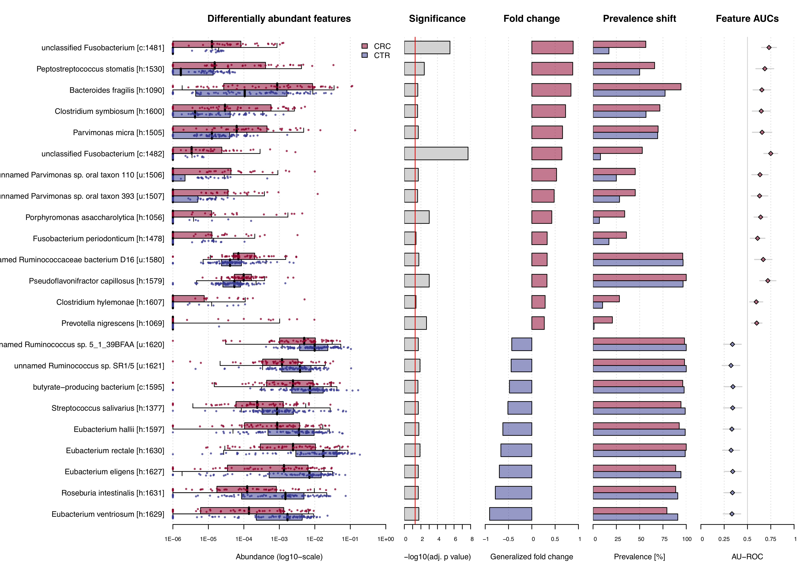

# About This Vignette

This vignette aims to be a short tutorial for the main functionalities of
`SIAMCAT`. Examples of additional workflows or more detailed tutorials can
be found in other vignettes (see the
[BioConductor page](https://bioconductor.org/packages/SIAMCAT)).

`SIAMCAT` is part of the suite of computational microbiome analysis tools
hosted at [EMBL](https://www.embl.org) by the groups of
[Peer Bork](https://www.embl.de/research/units/scb/bork/index.html) and
[Georg Zeller](https://www.embl.de/research/units/scb/zeller/index.html). Find
out more at [EMBL-microbiome tools](http://microbiome-tools.embl.de/).


# Introduction

Associations between microbiome and host phenotypes are ideally described by
quantitative models able to predict host status from microbiome composition.
`SIAMCAT` can do so for data from hundreds of thousands of microbial taxa, gene
families, or metabolic pathways over hundreds of samples. `SIAMCAT` produces
graphical output for convenient assessment of the quality of the input data and
statistical associations, for model diagnostics and inference revealing the
most predictive microbial biomarkers.

# Quick Start

For this vignette, we use an example dataset included in the `SIAMCAT` package.
As example dataset we use the data from the publication of
[Zeller et al](http://europepmc.org/abstract/MED/25432777), which demonstrated
the potential of microbial species in fecal samples to distinguish patients
with colorectal cancer (CRC) from healthy controls.

```{r load_files, message=FALSE}
library("SIAMCAT")

data("feat_crc_zeller", package="SIAMCAT")
data("meta_crc_zeller", package="SIAMCAT")
```

First, `SIAMCAT` needs a feature matrix (can be either a `matrix`, a
`data.frame`, or a `phyloseq-otu_table`), which contains values of different
features (in rows) for different samples (in columns). For example, the
feature matrix included here contains relative abundances for bacterial
species calculated with the [mOTU profiler](motu-tool.org) for 141 samples:

```{r show_features}
feat.crc.zeller[1:3, 1:3]
dim(feat.crc.zeller)
```

> Please note that `SIAMCAT` is supposed to work with **relative abundances**.
Other types of data (e.g. counts) will also work, but not all functions of the
package will result in meaningful outputs.


Secondly, we also have metadata about the samples in another `data.frame`:

```{r show_meta}
head(meta.crc.zeller)
```

In order to tell `SIAMCAT`, which samples are cancer cases and which are
healthy controls, we can construct a label object from the `Group` column in
the metadata.

```{r create_label}
label.crc.zeller <- create.label(meta=meta.crc.zeller,
    label='Group', case='CRC')
```

Now we have all the ingredients to create a `SIAMCAT` object. Please have a
look at the [vignette about input formats](SIAMCAT_read-in.html) for more
information about supported formats and other ways to create a `SIAMCAT` object.

```{r start}
sc.obj <- siamcat(feat=feat.crc.zeller,
    label=label.crc.zeller,
    meta=meta.crc.zeller)
```

A few information about the `SIAMCAT` object can be accessed with the `show`
function from `phyloseq` (`SIAMCAT` builds on the `phyloseq` data structure):

```{r show_siamcat}
show(sc.obj)
```

Since we have quite a lot of microbial species in the dataset at the moment, we
can perform unsupervised feature selection using the function `filter.features`.

```{r filter_feat}
sc.obj <- filter.features(sc.obj,
    filter.method = 'abundance',
    cutoff = 0.001)
```

# Association Testing

Associations between microbial species and the label can be tested
with the `check.associations` function. The function computes for each species
the significance using a non-parametric Wilcoxon test and different effect
sizes for the association (e.g. AUC or fold change).

```{r check_associations, eval=FALSE}
sc.obj <- check.associations(sc.obj, log.n0 = 1e-06, alpha = 0.05)
association.plot(sc.obj, sort.by = 'fc', 
                panels = c('fc', 'prevalence', 'auroc'))
```

The function produces a pdf file as output, since the plot is optimized for a
landscape DIN-A4 layout, but can also used to plot on an active graphic device,
e.g. in RStudio. The resulting plot then looks like that:


# Confounder Testing

As many biological and technical factors beyond the primary phenotype of 
interest can influence microbiome composition, simple association studies may
suffer confounding by other variables, which can lead to spurious results. 
The `check.confounders` function provides the option to test the associated
metadata variables for potential confounding influence. No information is stored
in the `SIAMCAT` object, but the different analyses are visualized and saved to
a combined pdf file for qualitative interpretation.

```{r check_confounders, eval=FALSE}
check.confounders(sc.obj, fn.plot = 'confounder_plots.pdf',
                    meta.in = NULL, feature.type = 'filtered')
```

The conditional entropy check primarily serves to remove nonsensical 
variables from subsequent checks. Conditional entropy quantifies the unique 
information contained in one variable (row) respective to another (column). 
Identical variables and derived variables which share the exact same information
will have a value of zero. In this example, the label was derived from the 
Group variable which was determined from AJCC stage, so both are excluded.


To better quantify potential confounding effects of metadata variables on 
individual microbial features, `check.confounder` plots the variance explained 
by the label in comparison with the variance explained by the metadata variable
for each individual feature. Variables with many features in the upper left 
corner might be confounding the label associations.


# Model Building

One strength of `SIAMCAT` is the versatile but easy-to-use interface for the
construction of machine learning models on the basis of microbial species.
`SIAMCAT` contains functions for data normalization, splitting the data into
cross-validation folds, training the model, and making predictions based on
cross-validation instances and the trained models.

## Data Normalization

Data normalization is performed with the `normalize.features` function. Here,
we use the `log.unit` method, but several other methods and customization
options are available (please check the documentation).

```{r normalize_feat}
sc.obj <- normalize.features(sc.obj, norm.method = "log.unit",
    norm.param = list(log.n0 = 1e-06, n.p = 2,norm.margin = 1))
```

## Prepare Cross-Validation

Preparation of the cross-validation fold is a crucial step in machine learning.
`SIAMCAT` greatly simplifies the set-up of cross-validation schemes, including
stratification of samples or keeping samples inseperable based on metadata.
For this small example, we choose a twice-repeated 5-fold cross-validation
scheme. The data-split will be saved in the `data_split` slot of the `SIAMCAT`
object.

```{r data_split}
sc.obj <-  create.data.split(sc.obj, num.folds = 5, num.resample = 2)
```

## Model Training

The actual model training is performed using the function `train.model`.
Again, multiple options for customization are available, ranging from the
machine learning method to the measure for model selection or customizable
parameter set for hyperparameter tuning.

```{r train_model, message=FALSE, results='hide'}
sc.obj <- train.model(sc.obj, method = "lasso")
```

The models are saved in the `model_list` slot of the `SIAMCAT` object. The
model building is performed using the `mlr` R package. All models can easily be
accessed.

```{r show_models}
# get information about the model type
model_type(sc.obj)

# access the models
models <- models(sc.obj)
models[[1]]$model
```

## Make Predictions

Using the data-split and the models trained in previous step, we can use the
function `make.predictions` in order to apply the models on the test instances
in the data-split. The predictions will be saved in the `pred_matrix` slot of
the `SIAMCAT` object.

```{r make_predictions, message=FALSE, results='hide'}
sc.obj <- make.predictions(sc.obj)
pred_matrix <- pred_matrix(sc.obj)
```
```{r pred_matrix_head}
head(pred_matrix)
```


# Model Evaluation and Interpretation

In the final part, we want to find out how well the model performed and which
microbial species had been selected in the model. In order to do so, we first
calculate how well the predictions fit the real data using the function
`evaluate.predictions`. This function calculates the Area Under the Receiver
Operating Characteristic (ROC) Curve (AU-ROC) and the Precision Recall (PR)
Curve for each resampled cross-validation run.

```{r eval_predictions}
sc.obj <-  evaluate.predictions(sc.obj)
```

## Evaluation Plot

To plot the results of the evaluation, we can use the function
`model.evaluation.plot`, which produces a pdf-file showing the ROC and PR
Curves for the different resamples runs as well as the mean ROC and PR Curve.

```{r eval_plot, eval=FALSE}
model.evaluation.plot(sc.obj)
```


## Interpretation Plot

The final plot produced by `SIAMCAT` is the model interpretation plot, created
by the `model.interpretation.plot` function. The plot shows for the top
selected features the

+ model weights (and how robust they are) as a barplot,

+ a heatmap with the z-scores or fold changes for the top selected features,
and

+ a boxplot showing the proportions of weight per model which is captured by
the top selected features.

Additionally, the distribution of metadata is shown in a heatmap below.

The function again produces a pdf-file optimized for a landscape DIN-A4
plotting region.

```{r eval=FALSE}
model.interpretation.plot(sc.obj, fn.plot = 'interpretation.pdf',
    consens.thres = 0.5, limits = c(-3, 3), heatmap.type = 'zscore')
```

The resulting plot looks like this:


# Session Info

```{r}
sessionInfo()
```
