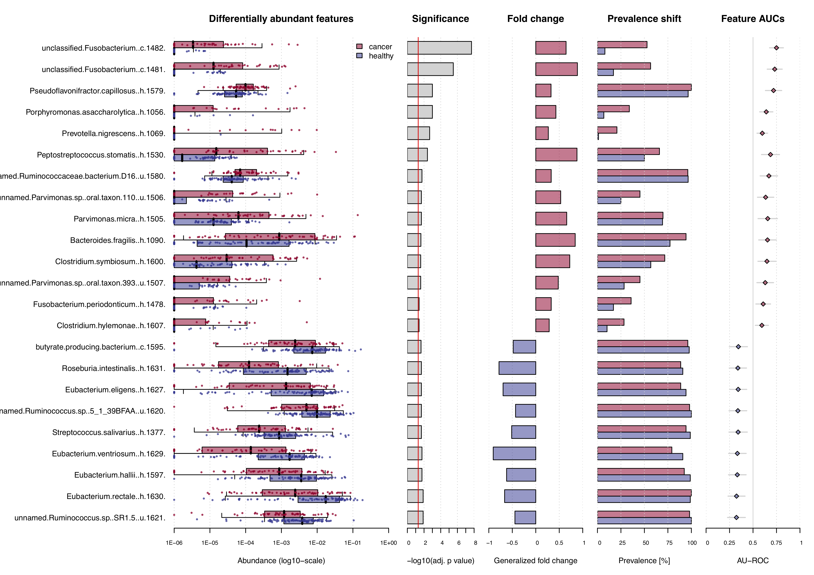
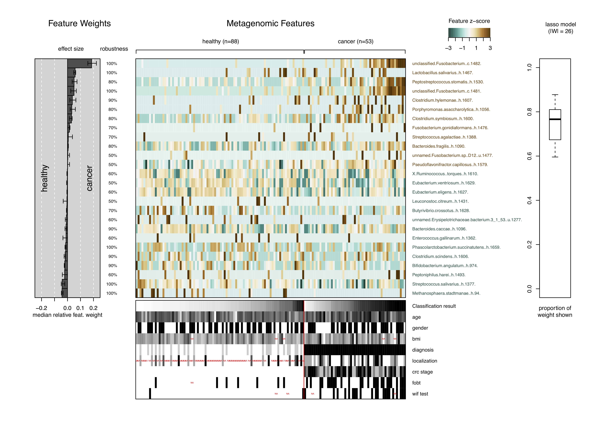

# About this vignette

This vignette aims to be a short tutorial for the main functionalities of
`SIAMCAT`. Examples of additional workflows or more detailed tutorials can
be found in other vignettes (see the
[BioConductor page](https://bioconductor.org/packages/SIAMCAT)).

`SIAMCAT` is part of the suite of computational microbiome analysis tools
hosted at [EMBL](https://www.embl.org) by the groups of
[Peer Bork](https://www.embl.de/research/units/scb/bork/index.html) and
[Georg Zeller](https://www.embl.de/research/units/scb/zeller/index.html). Find
out more at [EMBL-microbiome tools](http://microbiome-tools.embl.de/).


# Introduction

The promise of elucidating associations between the microbiota and their host,
with diagnostic and therapeutic potential, is fueling metagenomics research.
However, there is a lack of user-friendly software tools implementing robust
statistical testing and machine learning methods suitable for microbiome data.
Here, we describe `SIAMCAT`, a solution to this problem implemented as R 
package.

Associations between microbiome and host phenotypes are ideally described by
quantitative models able to predict host status from microbiome composition.
`SIAMCAT` can do so for data from hundreds of thousands of microbial taxa, gene
families, or metabolic pathways over hundreds of samples. `SIAMCAT` produces
graphical output for convenient assessment of the quality of the input data and
statistical associations, for model diagnostics and inference revealing  the
most predictive microbial biomarkers.

# First Steps: Read/Validate/Filter the Data

First, let us load the `SIAMCAT` package and use the files included
in `SIAMCAT`. The data are the same as used in the publication of
[Zeller et al](http://europepmc.org/abstract/MED/25432777),
which demonstrated the potential of microbial markers in fecal samples to
distinguish patients with colorectal cancer (CRC) from healthy controls.

```{r message=FALSE}
library(SIAMCAT)
fn.in.feat  <- system.file(
    "extdata",
    "feat_crc_zeller_msb_mocat_specI.tsv",
    package = "SIAMCAT"
)
fn.in.label <- system.file(
    "extdata",
    "label_crc_zeller_msb_mocat_specI.tsv",
    package = "SIAMCAT"
)
fn.in.meta  <- system.file(
    "extdata",
    "num_metadata_crc_zeller_msb_mocat_specI.tsv",
    package = "SIAMCAT"
)
```

We can access the files with the dedicated `SIAMCAT` functions and directly
construct a `SIAMCAT` object containing the microbial features, the patient's
labels, and metadata for the patients.
```{r message=FALSE}
feat  <- read.features(fn.in.feat)
label <- read.labels(fn.in.label)
meta  <- read.meta(fn.in.meta)
siamcat <- siamcat(feat, label, meta)
```

A few information about the `siamcat` object can be accessed with the `show`
function from `phyloseq`:

```{r}
show(siamcat)
```

In fact, `siamcat-class` object extends `phyloseq-class` object:
```{r}
phyloseq <- physeq(siamcat)
show(phyloseq)
```

The `validate.data` function ensures that we have labels for all the samples in
features and vice versa.

```{r}
siamcat <- validate.data(siamcat, verbose=1)
```

The data can also be sub-selected based on the available meta-data. For example,
if we want to exclude patients that are too young or too old for the question
of interest, we can do so easily with:

```{r}
siamcat <- select.samples(
    siamcat,
    filter = 'age',
    allowed.set = NULL,
    allowed.range = c(20, 90),
    verbose = 2
)
```

Since we have quite a lot of microbial markers in the dataset at the moment, we
perform unsupervised feature selection using the function `filter.features`.
Here, we filter based on overall abundance, but could also do so based on
prevalence or cumulative abundance.


```{r}
siamcat <- filter.features(
    siamcat,
    filter.method = 'abundance',
    cutoff = 0.001,
    recomp.prop = FALSE,
    rm.unmapped = TRUE,
    verbose = 2
)
```
# Association Testing

Associations between microbial markers and the label can be tested
with the `check.associations` function. The function computes a
generalized fold change for the marker, the prevalence shift, a single
feature AUC, and the significance of the association by using a Wilcoxon test.
The function again produces a pdf-file as output and is thus not run here,
but can be used as follows:

```{r eval=FALSE}
## Not run here, since the function produces a pdf-file as output
check.associations(
    siamcat,
    sort.by = 'fc',
    fn.plot = 'assoc.pdf',
    alpha = 0.05,
    mult.corr = "fdr",
    detect.lim = 10 ^-6,
    max.show = 50,
    plot.type = "quantile.box",
    panels = c("fc", "prevalence", "auroc"),
    verbose = 2
)
```
The resulting plot then looks like this:



# Model Building

Another feature of `SIAMCAT` is the versatile but easy-to-use interface for the
construction of machine learning models on the basis of microbial markers.
`SIAMCAT` contains functions for data normalization, splitting the data into
cross-validation folds, training the model, and making predictions based on
cross-validation instances and the trained models.

## Data Normalization

Data normalization is performed with the `normalize.features` function.
Several control options are available, for example a choice of the normalization
method from `log.unit`, `log.std`, `rank.unit`, `rank.std` and `log.clr` or
additional parameters. Here, we use the `log.unit` method:

```{r}
siamcat <- normalize.features(
    siamcat,
    norm.method = "log.unit",
    norm.param = list(
        log.n0 = 1e-06,
        n.p = 2,
        norm.margin = 1
    ),
    verbose = 2
)
```

## Prepare Cross-Validation

Preparation of the cross-validation fold is a crucial step in machine learning.
`SIAMCAT` greatly simplifies the set-up of cross-validation schemes, including
stratification of samples or keeping samples inseperable based on metadata.
For this small example, we choose a twice-repeated 5-fold cross-validation
scheme. The data-split will be saved in the `data_split` slot of the `siamcat`
object.

```{r}
siamcat <-  create.data.split(
    siamcat,
    num.folds = 5,
    num.resample = 2,
    stratify = TRUE,
    inseparable = NULL,
    verbose = 2
)
```

## Model Training

The actual model training is performed using the function `train.model`.
Again, multiple options for customization are available, ranging from the
machine learning method to the measure for model selection or customizable
parameter set for hyperparameter tuning. Here, we train a Lasso model and
enforce at least 5 non-zero coefficients.

```{r}
siamcat <- train.model(
    siamcat,
    method = "lasso",
    stratify = TRUE,
    modsel.crit = list("pr"),
    min.nonzero.coeff = 5,
    param.set = NULL,
    verbose = 0
)
```

The models are saved in the `model_list` slot of the `siamcat` object. This
slot stores objects of `model_list-class`. To get the complete list out of the
`siamcat` object:

```{r}
model_list <- model_list(siamcat)
```

This slot also stores information on which method was used to construct the
model:

```{r}
model_type(siamcat)
```

Models can also be easily accessed:

```{r}
models <- models(siamcat)
models[[1]]
```

## Make Predictions

Using the data-split and the models trained in previous step, we can use the
function `make.predictions` in order to apply the models on the test instances
in the data-split. The predictions will be saved in the `pred_matrix` slot of
the `siamcat` object.

```{r}
siamcat <- make.predictions(siamcat, verbose=0)
pred_matrix <- pred_matrix(siamcat)
head(pred_matrix)
```


# Model Evaluation and Interpretation

In the final part, we want to find out how well the model performed and which
microbial markers had been selected in the model. In order to do so, we first
calculate how well the predictions fit the real data using the function
`evaluate.predictions`. This function calculates the Area Under the Receiver
Operating Characteristic (ROC) Curve (AU-ROC) and the Precision Recall (PR)
Curve for each resampled cross-validation run. The results of the evaluation
will be stored in the `eval_data` slot of the `siamcat` object.

```{r}
siamcat <-  evaluate.predictions(siamcat, verbose=2)
```

## Evaluation plot

To plot the results of the evaluation, we can use the function
`model.evaluation.plot`, which produces a pdf-file showing the ROC and PR
Curves for the different resamples runs as well as the mean ROC and PR Curve.

```{r eval=FALSE}
## Not run here, since the function produces a pdf-file as output
model.evaluation.plot(siamcat,'eval_plot.pdf',verbose = 2)
```

Instead of the pdf-output, we can for this vignette also access the evaluation
data in the `siamcat` object directly and plot the ROC-Curves:

```{r fig.width = 6, fig.asp=1, fig.align="left"}
# plot ROC Curves
plot(
    NULL,
    xlim = c(0, 1),
    ylim = c(0, 1),
    xlab = 'False positive rate',
    ylab = 'True positive rate',
    type = 'n'
)
title('ROC curve for the model')
abline(a = 0, b = 1, lty = 3)
# for each resampled CV run
eval_data <- eval_data(siamcat)
for (r in 1:length(eval_data$roc.all)) {
    roc.c = eval_data$roc.all[[r]]
    lines(1 - roc.c$specificities, roc.c$sensitivities,
        col = gray(runif(1, 0.2, 0.8)))
}
# mean ROC curve
roc.summ = eval_data$roc.average[[1]]
lines(1 - roc.summ$specificities,
    roc.summ$sensitivities,
    col = 'black',
    lwd = 2)
# plot CI
x = as.numeric(rownames(roc.summ$ci))
yl = roc.summ$ci[, 1]
yu = roc.summ$ci[, 3]
polygon(1 - c(x, rev(x)), c(yl, rev(yu)), col = '#88888844' , border = NA)
```

## Interpretation plot

The final plot produced by `SIAMCAT` is the model interpretation plot, created
by the `model.interpretation.plot` function. The plot shows for the top
selected features the

+ model weights (and how robust they are) as a barplot,

+ a heatmap with the z-scores or fold changes for the top selected features, and

+ a boxplot showing the proportions of weight per model which is captured by the
top selected features.

Additionally, the distribution of metdata is shown in a heatmap below.

The function again produces a pdf-file as output and is thus not run here. An
example of how it can be used can be found below:

```{r eval=FALSE}
## Not run here, since the function produces a pdf-file as output
model.interpretation.plot(
    siamcat,
    fn.plot = 'interpretation.pdf',
    consens.thres = 0.5,
    norm.models = TRUE,
    limits = c(-3, 3),
    heatmap.type = 'zscore',
    verbose = 2
)
```

The resulting plot looks like this:




# Session Info

```{r}
sessionInfo()
```
